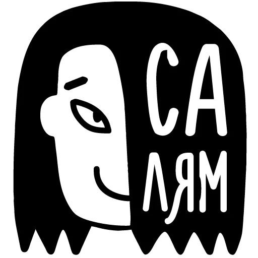

<picture align="left">
  <source media="(prefers-color-scheme: dark)" srcset="hello_dark.png">
  <source media="(prefers-color-scheme: light)" srcset="hello_light.jpg">
  
</picture>

### roaddust2

Hello, my name is Mark, welcome to my GitHub page!

 
 

## About
I'm a Business System Analyst (BA/BSA)  
Currently learning Python at [Hexlet](https://ru.hexlet.io/)  
### My educational projects:

)

